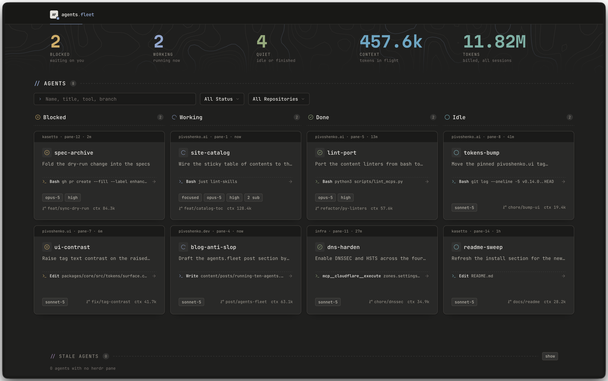

# pivoshenko.ai

<p align="left">
  <a href="https://stand-with-ukraine.pp.ua/">
    
  </a>
</p>

## Overview

This repository is managed with [Kasetto](https://github.com/pivoshenko/kasetto). It pulls personal **and** external skills, MCPs, and instructions from upstream repositories into one synced setup. The full source list lives in [`kasetto.yaml`](kasetto.yaml).

**What's in here?**

- Locally authored skills, see [`skills/`](skills)
- Locally authored MCP definitions, see [`mcps/`](mcps)
- Locally authored instructions (`CLAUDE.md` / `AGENTS.md` / `.cursor/rules` ... rule fragments), see [`instructions/`](instructions)
- External skills, MCPs, and instructions, see [`kasetto.yaml`](kasetto.yaml)
- Herdr plugins, the only executable content here, see [`plugins/`](plugins)
- Retired skills and instructions, kept for reference but no longer synced, see [`archive/`](archive)

## Main Principles

- Minimalism: keep only skills and MCPs that are used daily
- Consistency: same conventions across all locally authored skills
- Composability: skills are small, single-purpose, and chainable
- Source of truth: upstream skills are pulled, not forked, so updates stay free

## Installation

1. Install Kasetto, see the [installation guide](https://github.com/pivoshenko/kasetto#installation)
2. Sync skills and MCPs into your local Claude Code config. Either run:

```shell
kst sync --config https://github.com/pivoshenko/pivoshenko.ai/blob/main/kasetto.yaml
```

Or add the source to `~/.config/kasetto/config.yaml` and then run `kst sync`:

```yaml
source: https://github.com/pivoshenko/pivoshenko.ai/blob/main/kasetto.yaml
```

## Plugins

[`plugins/`](plugins) holds agent-host plugins, one directory per host, so far only [`plugins/herdr`](plugins/herdr) for [Herdr](https://herdr.dev): workflow tools that run as real processes rather than prompt fragments. Kasetto does not distribute them. They are installed by Herdr itself, listed one per line in [`herdr.plugins`](https://github.com/pivoshenko/pivoshenko.dotfiles/blob/main/herdr.plugins) in [`pivoshenko.dotfiles`](https://github.com/pivoshenko/pivoshenko.dotfiles) and applied by `just install-herdr-plugins`:

```shell
herdr plugin install pivoshenko/pivoshenko.ai/plugins/herdr/<name>
```

This is the one exception to the rule that content here is Markdown and JSON with no build step, so it comes with its own constraints:

- A plugin is ordinary code that runs as your user and can call the full Herdr CLI, so review a manifest before installing it
- Plugins are global to the user, and a `[[startup]]` hook runs on every Herdr session, in every project
- Herdr has no `plugin update` in v1, so refreshing a plugin means reinstalling it

### agents.fleet

[`plugins/herdr/agents.fleet`](plugins/herdr/agents.fleet) is a status page for every coding agent on the machine: a board of who is working, who is waiting on you, and what each one is doing right now, plus what closed agents produced.



## Rules

Reusable agent rules, the behavioral guardrails that aren't project-specific, live in [`instructions/`](instructions), one Markdown file per rule. Kasetto distributes them as its **instruction** asset kind: each is transformed into the target agent's native instruction file (`CLAUDE.md`, `AGENTS.md`, `.cursor/rules`, ...) and merged in as a managed block, so hand edits and other rules survive a re-sync.

The `instructions/` files **are** the source for my global rules. Kasetto syncs them into `~/.claude/CLAUDE.md` as managed blocks.

## Archive

[`archive/`](archive) holds what used to be part of the synced setup and got retired. Kasetto only pulls from `skills/`, `mcps/`, and `instructions/`, so moving something here takes it out of the agent config while keeping it readable in git.
